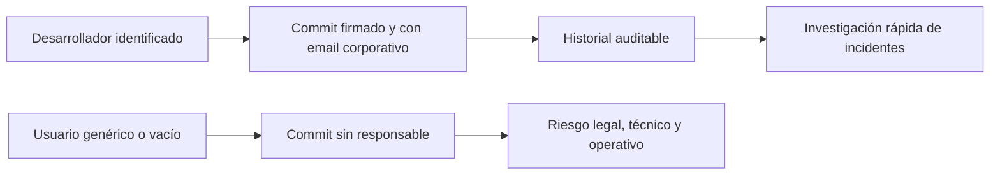
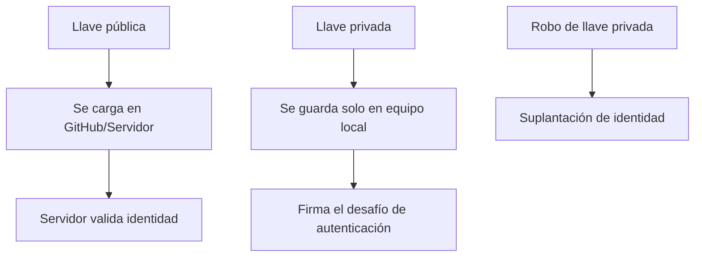
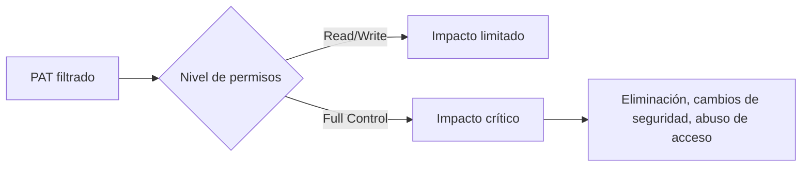
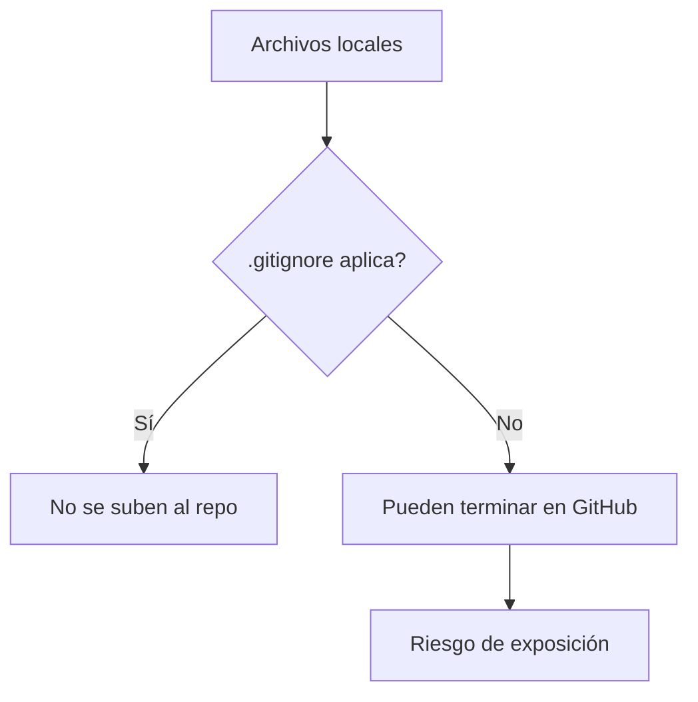
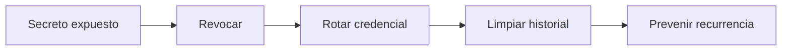

# Taller 1 — Análisis DevSecOps (Respuesta Profesional)

> **Fecha:** 04/03/2026  
> **Tema:** Trazabilidad, SSH, mínimo privilegio, higiene del repositorio y exposición de secretos.

---

## 1) Trazabilidad

### Pregunta
¿Por qué es un riesgo de seguridad dejar la configuración de `user.name` y `user.email` vacía o usar datos genéricos en un entorno empresarial?

### Respuesta
En un entorno empresarial, cada commit debe estar asociado a una identidad real y verificable. Si `user.name` y `user.email` están vacíos o son genéricos:

- Se pierde la trazabilidad de quién realizó cada cambio.
- Se dificulta la investigación de incidentes y auditorías.
- No se puede asignar responsabilidad sobre errores o vulnerabilidades.
- Se debilita el cumplimiento de políticas internas y normas de seguridad.

**Conclusión:** la identidad Git correcta es un control de seguridad y de auditoría, no solo un dato de configuración.

### Imagen (flujo de trazabilidad)

---

## 2) Cifrado asimétrico (SSH)

### Pregunta
¿Cuál es la diferencia funcional entre la llave privada y la pública? ¿Qué pasa si un tercero obtiene la llave privada?

### Respuesta
SSH usa criptografía asimétrica:

- **Llave pública:** se comparte con el servidor (GitHub/GitLab/servidor SSH) para registrar tu identidad.
- **Llave privada:** permanece en tu equipo y se usa para demostrar que eres el dueño legítimo de la llave pública.

Si alguien roba la llave privada, podrá autenticarse como tú y podría:

- Acceder a repositorios privados.
- Subir cambios maliciosos.
- Descargar o exfiltrar información sensible.

**Conclusión:** la llave privada es crítica; debe protegerse con passphrase y nunca compartirse.

### Imagen (relación de llaves)

---

## 3) Principio de Mínimo Privilegio (PAT)

### Pregunta
¿Qué riesgos tiene asignar permisos de Administrador (Full Control) a un PAT en vez de Lectura/Escritura?

### Respuesta
El principio de mínimo privilegio indica que un usuario o token debe tener solo permisos estrictamente necesarios.

Un PAT con **Full Control** aumenta el impacto ante fuga o robo, porque permite acciones críticas como:

- Eliminar repositorios.
- Cambiar configuraciones de seguridad.
- Modificar permisos de colaboradores.
- Acceder a recursos no necesarios para la tarea.

Con permisos limitados (lectura/escritura), el daño potencial se reduce considerablemente.

**Conclusión:** menos privilegios = menor superficie de ataque.

### Imagen (comparación de impacto)

---

## 4) Higiene del repositorio (`.gitignore`)

### Pregunta
¿Para qué sirve `.gitignore` desde seguridad? Menciona al menos dos tipos de archivos que nunca deben subirse.

### Respuesta
`.gitignore` evita que archivos sensibles o innecesarios se agreguen al repositorio remoto por error.

Ayuda a prevenir exposición de información crítica y reduce riesgo operacional.

**Archivos que no deben subirse (ejemplos):**

1. **Secretos y credenciales:** `.env`, `*.key`, `*.pem`, `id_rsa`.
2. **Configuraciones locales sensibles:** `config.local.*`.
3. **Logs o volcados con datos sensibles:** `*.log`, `*.dump`.
4. **Archivos temporales del sistema:** `.DS_Store`, `Thumbs.db`.

**Conclusión:** `.gitignore` es una barrera preventiva básica contra filtraciones accidentales.

### Imagen (prevención con .gitignore)

---

## 5) Exposición de secretos en GitHub

### Pregunta
Si subes accidentalmente una API key o contraseña, ¿basta con borrarla y hacer otro commit?

### Respuesta
No es suficiente. Aunque borres el archivo en un commit nuevo, el secreto sigue presente en el historial Git y puede recuperarse.

### Acciones correctas
1. Revocar inmediatamente la credencial comprometida.
2. Generar una nueva credencial.
3. Limpiar el historial del repositorio (`git filter-repo` u otra técnica de reescritura).
4. Verificar que no queden copias en forks, caches o pipelines.
5. Implementar controles preventivos (secret scanning, hooks, variables de entorno, gestor de secretos).

**Conclusión:** borrar en un commit posterior no elimina la exposición real del secreto.

### Imagen (respuesta a incidente)

---

## Recomendaciones finales (nivel profesional)

- Usar cuentas corporativas con **MFA**.
- Activar **branch protection** y pull request obligatorio.
- Exigir revisiones de código y escaneo de seguridad en CI/CD.
- Limitar permisos de tokens y rotarlos periódicamente.
- Habilitar herramientas de detección de secretos (por ejemplo, Gitleaks/Secret Scanning).

